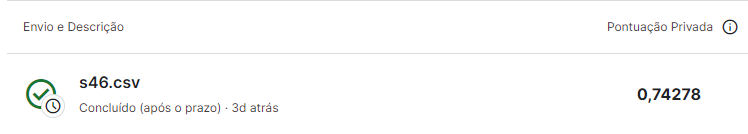
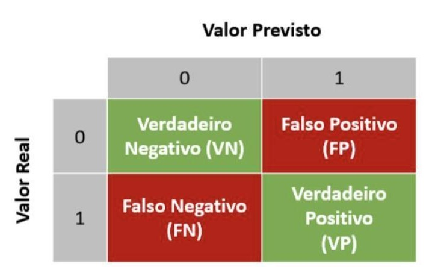

# Credit Card Fraud

---

# 1. Business Problem

Um grande banco brasileiro tem sido prejudicado constantemente por erros nos diagnósticos de fraudes a seus clientes. Imagine estar no caixa de um supermercado, com uma longa fila atrás de você, o caixa anuncia de maneira não muito silenciosa que seu cartão foi recusado. Envergonhado, e certo de que tem fundos para cobrir tudo o que é necessário, você tenta seu cartão novamente.  Mesmo resultado. Ao se afastar e permitir que o caixa atenda ao próximo cliente, você recebe uma mensagem de texto do seu banco: “Responda esse SMS se você realmente efetuou uma compra no valor de R$ 500,00 em um queijo cheddar". Insatisfeito, você tem seu cartão temporariamente bloqueado, recebe um e-mail de atividade suspeita e posteriormente tem sua conta suspensa. 

Situações como estas são comuns e geram grande desconforto ao cliente, além de prejudicar a reputação da instituição. Em alguns casos mais graves, os clientes podem levar esta situação à justiça. Estima-se que aproximadamente 100 mil ações contra bancos são feitas por ano no Brasil. 

Dito isso, o objetivo deste trabalho é criar um modelo que detecte fraude com maior precisão, melhorando a experiência do cliente e diminuindo os casos de "falsos positivos", ou seja, os casos de suspeita de fraude de maneira equivocada. 

# 2. Business Assumption

Para este projeto, os dados foram obtidos na plataforma do Kaggle, em uma competição já encerrada da plataforma. Por se tratar de um conjunto de dados envolvendo transações financeiras, os atributos do dataset aqui são chamados apenas de "feat" de 1 até 28. Além disso, os dados já estão preparados. Há apenas uma exceção, a coluna "Transaction_amount", informando o valor de cada transação. A coluna "Is_Fraud" é a variável resposta, em que 0 configura transação normal e 1 configura fraude. As primeiras colunas 'id' e 'time' por não apresentar qualquer correlação com a incidência de fraudes, não foram consideradas para o treinamento de algoritmo de machine learning.

# 3. Solution Strategy 

- O modelo será construído em Python.
- Metodologia cíclica CRISP, dividido em 10 ações: 

1. Compreender o Problema de Negócio
2. Coletar os dados
3. Limpar os Dados
4. Realizar Análise Exploratória dos Dados
5. Preparação dos Dados ("Transaction Amount").
6. Selecionar as variáveis mais relevantes
7. Treinar algoritmos de Machine Learning
8. Avaliar a performance desses algoritmos
9. Gerar a Matriz de Confusão
10. Propor a solução final

- A qualidade do modelo será baseada na métrica área sob a curva ROC, que é uma medida de desempenho para modelos de Classificação. A ROC AUC representa a capacidade do modelo de distinguir entre as classes positiva e negativa, variando de 0 a 1. De tal forma que uma área de 0,5 indica um desempenho aleatório, enquanto uma área de 1,0 indica um desempenho perfeito.

# 4. Insight

Durante a análise exploratória de dados, foram gerados insights, através da validação das hipóteses. Insights são informações novas, ou que contrapõem crenças que o time de negócios, ou neste caso, a opinião pública, têm em mente. 

### H1. Transações fraudulentas tem valores mais altos. 

**VERDADEIRA**. A média do valor das transações fraudulentas é maior que o dobro das transações sem fraude (143 a 70)

| is_fraud | transaction_amount |
|----------|--------------------|
|    0     |      70.934880     |
|    1     |     143.600558     |

Como as features são sigilosas e não contêm suas principais informações, não é viável a criação de outras hipóteses.

# 5. Machine Learning Model Applied 

Após a preparação da varíavel "transaction_amount" (única ainda não preparada), foram treinados 5 modelos de Aprendizado de Máquina com objetivo de encontrar o melhor algoritmo que descreva e explique o problema proposto. Antes disso, também foi verificado o Baseline Model, que é a situação esperada sem a utilização de Machine Learning, baseada na média histórica de casos. 

- Random Forest Classifier
- Extra Tree Classifier
- LGBM Classifier
- XGBoost Classifier
- Logistic Regression 

Random Forest, Logistic Regression e Extra Tree Classifier tiveram desempenhos muito próximos, por volta dos 0,79. Um pouco mais abaixo, o XGBoost com 0,72. Já o LGBM não teve bom desempenho, com área sob a curva ROC de apenas 0,5. Assim, de tal forma, para este projeto, utilizaremos este modelo, para fazer comparações, como baseline, ou seja, um modelo em que é semelhante utilizar uma escolha aleatória para as previsões.

Todos os três modelos com a maior área sob a curva ROC foram submetidos na plataforma do Kaggle para verificação do desempenho nos dados em produção, de teste. E, assim, aquele modelo que apresentou melhor resultado foi a Random Forest (0,74)

- Matriz de Confusão 

É uma pequena tabela que mostra a performance de um modelo de classificação em termos de verdadeiros positivos, verdadeiros negativos, falsos positivos e falsos negativos. É uma ferramenta útil para avaliar a precisão de um modelo em relação às diferentes classes. 

### Matriz para o modelo baseline (LGBM)

Para o modelo aleatório, a matriz de confusão apresentou 149 casos de falsos positivos, ou seja, transações apontadas como fraudulentas, porém que na verdade não são fraudulentas. E dos 57 casos reais de fraude, este modelo não foi capaz de prever nenhum deles. 

|                | Negativo | Positivo |
|----------------|------------------|------------------|
| 0  | 29412            | 149              |
| 1  | 57               | 0                |

### Matriz para o modelo Random Forest Classifier

Já para o modelo escolhido para este projeto, apesar de conseguir prever apenas 2 dos 57 casos de fraude do dataset, aqui a quantidade de falsos positivos é de apenas 5. Ou seja, quase ninguém será acusado de fraude injustamente. 

|                | Negativo | Positivo |
|----------------|------------------|------------------|
| 0  | 29556            | 5              |
| 1  | 55               | 2               |

# 6. Business Result

Portanto, com este modelo, o banco conseguirá evitar que 144 pessoas, a cada 29618 transações, fiquem insatisfeitas com o serviço prestado. Sabe-se que, destas pessoas, muitas delas vão conseguir resolver o problema com a instituição e que não são todos os casos que o cliente terá sua conta suspensa/bloqueada por muitos dias. De tal forma, temos algumas premissas: 

### Premissas
**1** Apenas 2% dos clientes afetados querem entrar com uma ação indenizatória contra o banco.

**2** Em média, cada ação indeniza o cliente no valor de R$ 7000,00.

**3** Neste banco acontecem 5 milhões de transações por cartão de crédito diariamente.

Assim: 
2% de 144 clientes, temos que 3 clientes entram com uma ação. 

R$ 7000,00*3 = R$ 21000,00 por 29618 transações

Porém, o número de transações diárias é de 5 milhões, cerca de 168,8 vezes a mais que a quantidade de transações deste conjunto de dados estudado.

Então: 
21.000,00*168,8 = R$ 3.545.141,47 por dia

Logo, por ano:
R$ 3.545.141,47*365 = aproximadamente 1,3 bilhão de reais

Considerando o faturamento médio anual deste banco brasileiro, como um faturamento próximo ao dos maiores bancos do país, de por volta de R$ 7 bilhões, com este acréscimo de R$ 1,3 bi, o banco terá faturamento de R$ 8,3 bilhões.

Configurando assim, um acréscimo anual de 18 % no seu faturamento, devido à contribuição deste projeto de ciência de dados. 

# 7. Conclusions

Os resultados mostram que o objetivo do projeto foi alcançado, gerando ao final um desempenho satisfatoriamente melhor que o modelo randômico. A questão das fraudes é muito séria e tem potencial para envolver e movimentar muito dinheiro, como mostrado acima. 

# 8. Lessons Learned e Next Steps 

Em projetos seguintes, além do que já foi feito, podem ser incrementados:

- Tentar trabalhar com maior quantidade de dados e maior quantidade de transações positivas para fraude.
- Analisar outros impactos pro negócio
- Testar outras formas de preparação e filtragem dos dados

# 9. References

- O enunciado do projeto e os datasets estão em: [Kaggle](https://www.kaggle.com/competitions/credit-card-fraud-prediction/overview)
- A imagem de capa: [Pexels](https://www.pexels.com/pt-br/foto/pessoa-com-cartao-de-debito-50987/)
- Imagem CRISP: [Arte dos Dados](https://artedosdados.blogspot.com/2013/12/mineracao-de-dados-e-o-crisp-dm-data.html)